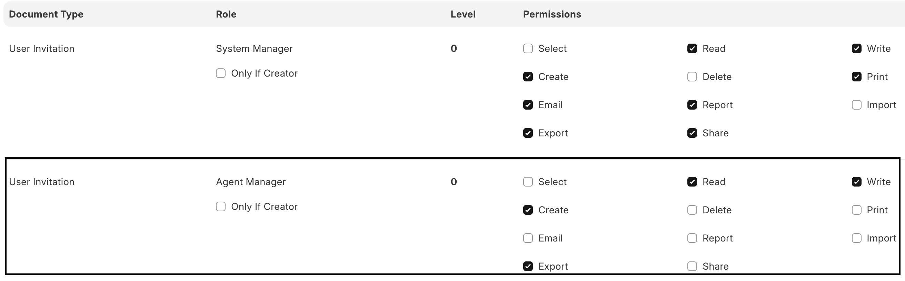
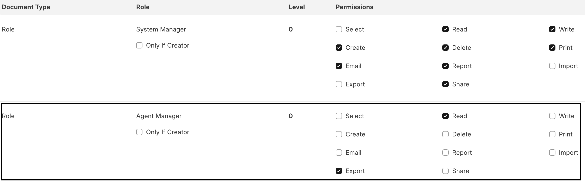
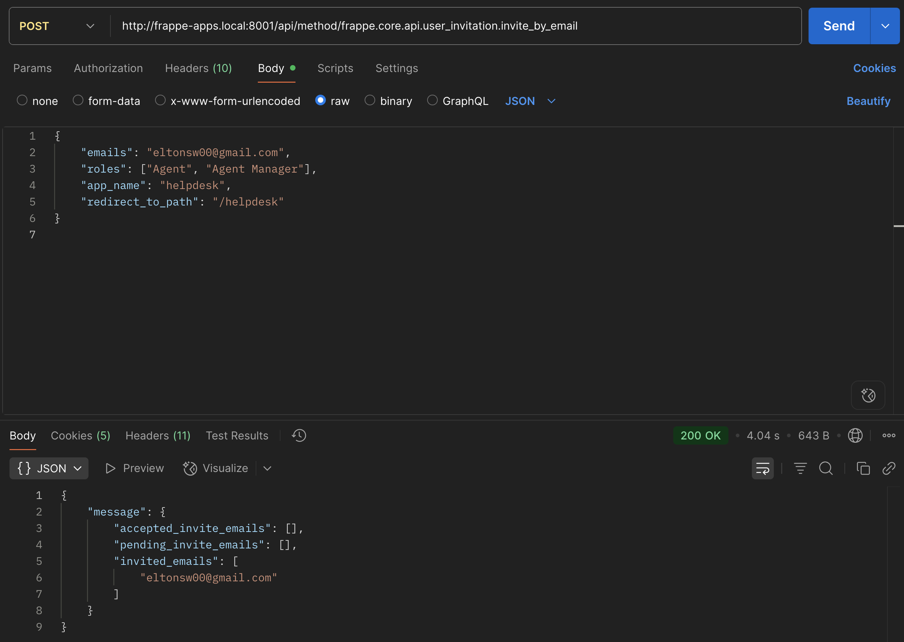
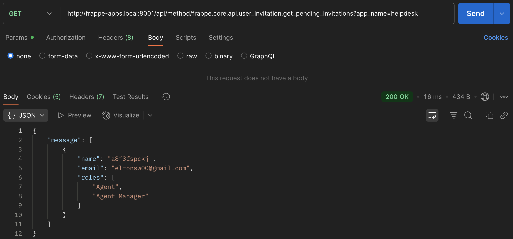
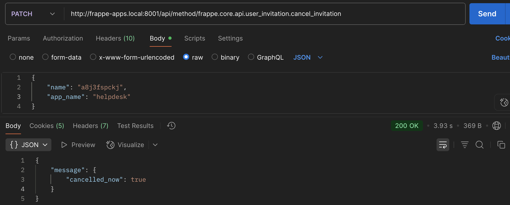

# User Invitation

## Index

- [Motivation](#motivation)
- [How to use it?](#how-to-use-it)
- [Whitelisted functions](#whitelisted-functions)
  - [`invite_by_email`](#invite_by_email)
  - [`accept_invitation`](#accept_invitation)
  - [`get_pending_invitations`](#get_pending_invitations)
  - [`cancel_invitation`](#cancel_invitation)
- [Normal flow](#normal-flow)
- [Important points](#important-points)

## Motivation

- Until now, there was no way to invite and create a new user based on a sent invitation that can be accepted or rejected by the invitee.
- Due to this, custom Framework applications have to implement a user invitation flow. But most of the rules around this flow are generic enough to let Framework store all of the common logic associated with a typical user invitation flow.
- This will help ensure consistency and prevent code duplication for custom Framework applications that need this type of feature.

## How to use it?

Define user invitation hooks in your app's `hooks.py` file. An example is shown below.


- `allowed_roles`

  A map of `only_for` roles to a list of roles that are allowed to be invited to your app.

- `after_accept`

  Dot path of the function to execute after the user accepts the invitation.

  ```python
  from frappe.model.document import Document

  def after_accept(
   invitation: Document,
   user: Document,
   user_inserted: bool
  ) -> None:
      # your business logic here
  ```

> `after_accept` is optional and should be used only if required.

At this point, you can start using the whitelisted functions under the `apis` section (`frappe/core/api/user_invitation.py`). For more information, read [whitelisted functions](#whitelisted-functions).

By default, only `System Manager`s can create a new invitation, view the list of invitations, or view more details associated with a single invitation **using the desk**. To enable users with specific roles to perform the mentioned actions, you might want to provide `create`, `read`, and `write` access to the relevant roles.

Example - If a user having the `Agent Manager` role should be able to use all of the user invitation features using the desk, these should be enabled:

- User Invitation doctype
  

- Role doctype
  

## Whitelisted functions

There are a few whitelisted functions that can be used to manage invitations. All of the whitelisted functions are in `frappe/core/api/user_invitation.py`.

### `invite_by_email`

Invite new emails to your application.



> The invited email will receive an email with a link to accept the invitation.

### `accept_invitation`

Enables invitees to accept the sent invitations.

> This function should not be used directly. The only reason this function is whitelisted is because the sent invitations contain a link that the invitees use to accept the invitations.

### `get_pending_invitations`

Get all of the pending invitations associated with an installed Framework application.



### `cancel_invitation`

Cancels a specific pending invitation associated with an installed Framework application.



## Normal flow

1. Invitations are created from the desk or by using the [`invite_by_email`](#invite_by_email) whitelisted function. An email is sent to the invited email with a link to accept the invitation.
2. The app administrator or anyone able to use the desk can cancel invitations. Once an invitation is cancelled, an email is sent to the creator of the invitation.
3. Once the invitation is accepted, a new user is created (if required) with the roles specified in the invitation and is redirected to the specified path.
4. If the invitee doesn't accept the invitation within three days, the invitation is marked as expired by a background job that executes every day. Currently, there is no way to customize the expiration time.

## Important points:

- There can't be multiple pending invitations for the same app.
- Once an invitation document is created from Desk, all of the fields are immutable except the `Redirect To Path` field which is mutable only when the invitation status is `Pending`.
- To manually mark an invitation as expired, you can use the `expire` method on the invitation document.
- To manually cancel an invitation, you can use the `cancel_invite` method on the invitation document.
- Disabled users cannot be invited. Trying to invite a disabled user from the Desk will generate an error and the whitelisted functions will ignore emails associated with disabled users.
